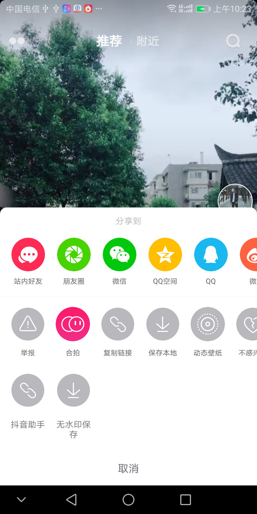
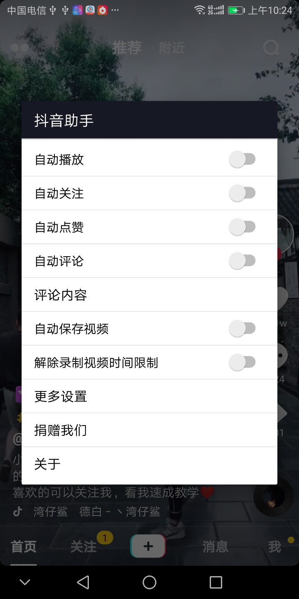

# xposed-aweme

### 基于Xposed框架写的 `抖音` 插件

#### 主要的功能
1. 自动切换下一个视频播放(用户可自定义时间)
2. 自动关注与点赞(切换视频时触发)
3. 手动或自动下载无水印视频到本地(切换视频时触发)
4. 自动评论(无需打开讨论界面即可完成)
5. 解除录制视频15秒限制(用户可自定义时间)

#### 配置的入口
1. 视频界面 -> 分享 -> 抖音助手

##### 支持的版本
1. v1.4.0版本支持抖音(v1.8.1,v1.8.2,v1.8.3,v1.8.5,v1.8.7,v1.9.0,v2.0.0,v2.0.1,v2.1.0)

#### Xposed Module Repository
[http://repo.xposed.info/module/com.sky.xposed.aweme](http://repo.xposed.info/module/com.sky.xposed.aweme)

QQ交流群: 
1. __794327446__(已满) 
2. __824933593__

### 截图

## License

    Copyright 2018 The sky Authors

    Licensed under the Apache License, Version 2.0 (the "License");
    you may not use this file except in compliance with the License.
    You may obtain a copy of the License at

       http://www.apache.org/licenses/LICENSE-2.0

    Unless required by applicable law or agreed to in writing, software
    distributed under the License is distributed on an "AS IS" BASIS,
    WITHOUT WARRANTIES OR CONDITIONS OF ANY KIND, either express or implied.
    See the License for the specific language governing permissions and
    limitations under the License.
